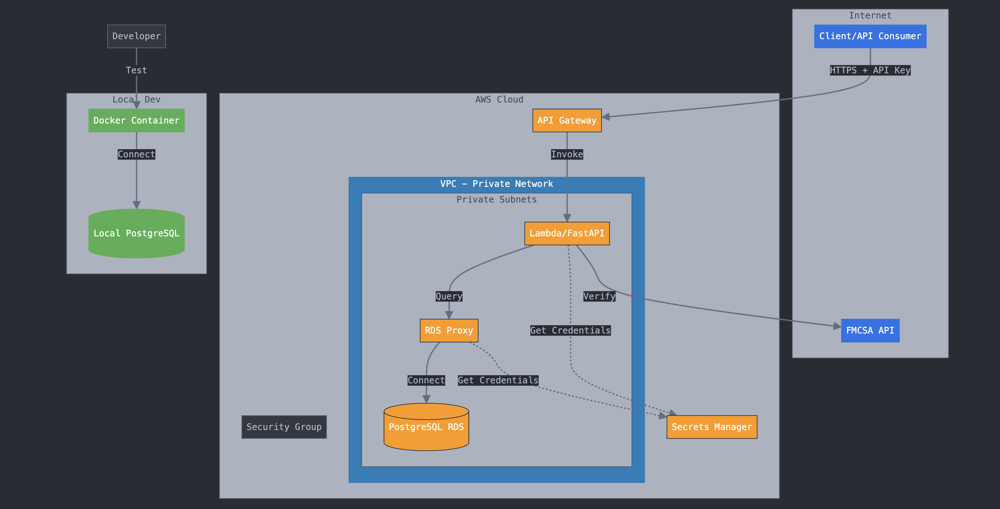

# Carrier and Load API

This repository contains the codebase for the Carrier Verification and Load Management API. Here's an architecture overview:



## Project Structure

```
carrier_and_load_api/
|
|-- carrier_verification/
|   |
|   |-- app/
|   |   |
|   |   |-- __init__.py
|   |   |-- main.py
|   |   |-- models.py
|   |   |-- routes/
|   |   |   |-- __init__.py
|   |   |   |-- carrier.py
|   |   |   `-- load.py
|   |   `-- utils.py
|   |
|   |-- deploy.sh
|   |-- .env.example
|   `-- requirements.txt
|
|-- data_uploads_lambda/
|   |
|   |-- app/
|   |   |
|   |   |-- __init__.py
|   |   |-- handler.py
|   |   |-- utils.py
|   |   `-- requirements.txt
|   |
|   |-- deploy.sh
|   `-- requirements.txt
|
|-- .gitignore
|-- README.md
`-- docker/
    |-- README.md
    |-- docker-compose.yml
    |-- docker-compose.prod.yml
    |-- Dockerfile
    |-- Dockerfile.prod
    |-- db/
    |   |-- init.sql
    `-- .dockerignore
```

- **carrier_verification**: Contains the FastAPI application for carrier verification and load management.
  - `app/`: The main application code, including API routes, database models, and configuration.
  - `deploy.sh`: Script for creating the zip file containing the handler for deployment with AWS Lambda.
  - `requirements.txt`: Python dependencies for the application.

- **data_uploads_lambda**: Contains the AWS Lambda function for uploading CSV data to the database.
  - `app/`: The main application code that uploads CSV data to the PostgreSQL AWS RDS instance. 
  - `deploy.sh`: Script for creating the zip file containing the handler for deployment with AWS Lambda.
  - `requirements.txt`: Python dependencies for the Lambda function.

## Built with

- **FastAPI**: Used to build the main API for carrier verification and load management.
- **SQLAlchemy**: Employed as the ORM to interact with the PostgreSQL database.
- **AWS Lambda**: Utilized for deploying the Data Uploads Lambda function, enabling serverless execution of code in response to events without managing servers.
- **Pydantic**: Used for data validation and settings management.
- **PostgreSQL using AWS RDS (instance and proxy)**: Chosen as the relational database to store load data, providing robust data integrity and support for complex queries.

## Deployment

The deployment scripts are designed to package the application and its dependencies for AWS Lambda. Ensure that the `.env` file is correctly configured with your environment variables before deployment.

## Getting Started

1. Clone the repository.
2. Set up your virtual environment and install dependencies using `pip install -r requirements.txt`.
3. Configure your `.env` file based on `.env.example`.
4. Run the application locally using `uvicorn carrier_verification.app.main:app --reload`.
5. Create the Lambda handler zip file using the provided `deploy.sh` scripts.
6. Upload the zip file to AWS Lambda.

## Docker
See docker folder. 
